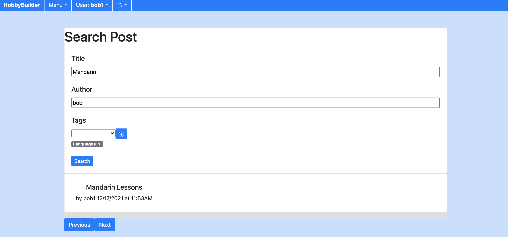
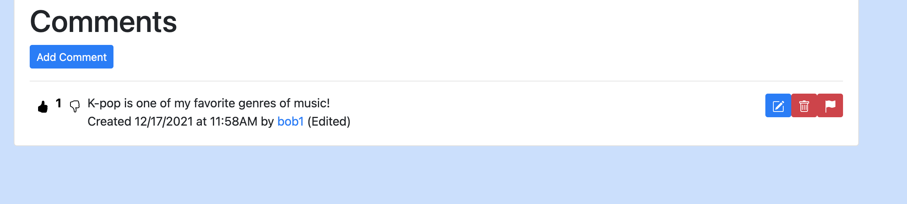
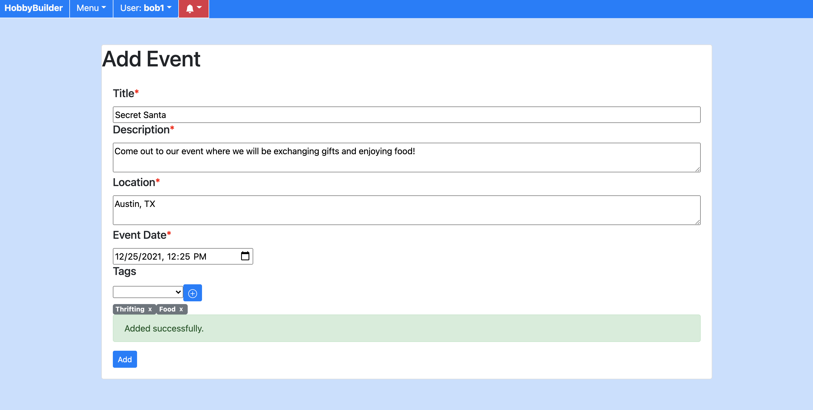
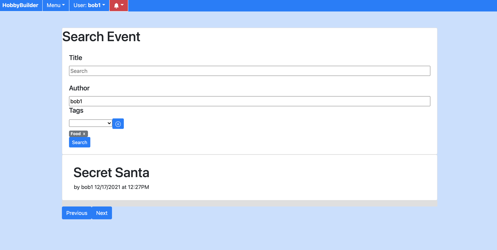
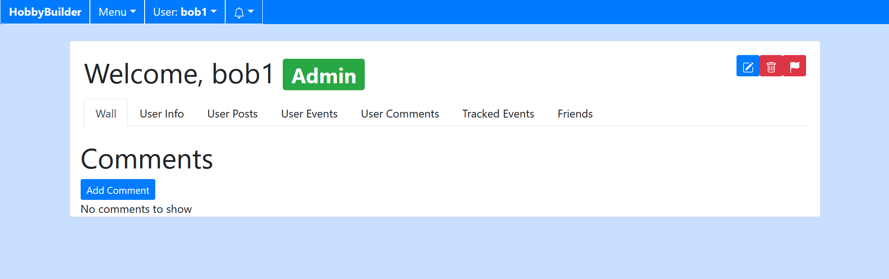
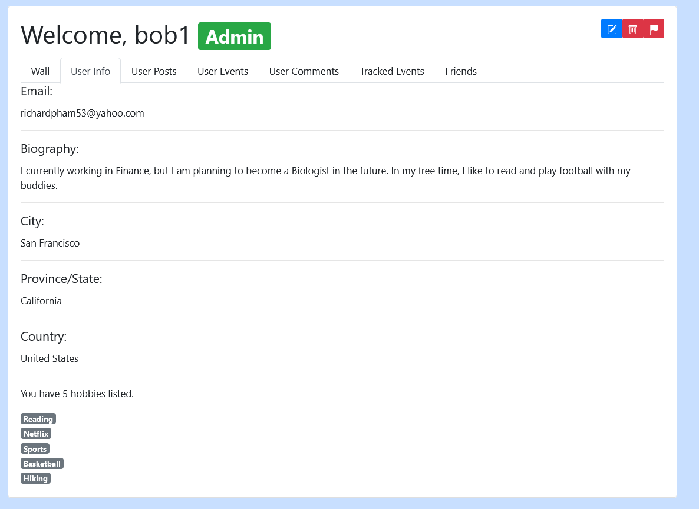
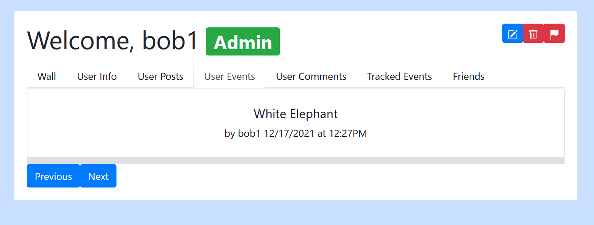

# Hobby Builder

Personal Project created by Richard Pham. 

### Table of Contents

- [Project Introduction](https://github.com/richardpham1998/hobby-builder#introduction)
- [Features](https://github.com/richardpham1998/hobby-builder#features)
	- [Sign Up](https://github.com/richardpham1998/hobby-builder#sign-up)
	- [Log In](https://github.com/richardpham1998/hobby-builder#log-in)
	- [Home Page](https://github.com/richardpham1998/hobby-builder#home-page)
	- [Menu](https://github.com/richardpham1998/hobby-builder#menu)
	- [Log Out](https://github.com/richardpham1998/hobby-builder#log-out)
	- [Notifications](https://github.com/richardpham1998/hobby-builder#notifications)
	- [Add Post](https://github.com/richardpham1998/hobby-builder#add-post)
	- [Search Post](https://github.com/richardpham1998/hobby-builder#search-post)
	- [Like Or Dislike](https://github.com/richardpham1998/hobby-builder#like-or-dislike)
	- [Add Comment](https://github.com/richardpham1998/hobby-builder#add-comment)
	- [Log In](https://github.com/richardpham1998/hobby-builder#log-in)
	- [Like Or Dislike Comment](https://github.com/richardpham1998/hobby-builder#like-or-dislike-comment)
	- [Edit Comment](https://github.com/richardpham1998/hobby-builder#edit-comment)
	- [Delete Comment](https://github.com/richardpham1998/hobby-builder#delete-comment)
	- [Edit Post](https://github.com/richardpham1998/hobby-builder#edit-post)
	- [Add Report](https://github.com/richardpham1998/hobby-builder#add-report)
	- [Delete Post](https://github.com/richardpham1998/hobby-builder#delete-post)
	- [Add Event](https://github.com/richardpham1998/hobby-builder#add-event)
	- [Search Event](https://github.com/richardpham1998/hobby-builder#search-event)
	- [Event Interaction](https://github.com/richardpham1998/hobby-builder#event-interaction)
	- [Edit Event](https://github.com/richardpham1998/hobby-builder#edit-event)
	- [Delete Event](https://github.com/richardpham1998/hobby-builder#delete-event)
	- [Add Friend](https://github.com/richardpham1998/hobby-builder#add-friend)
	- [Unfriend](https://github.com/richardpham1998/hobby-builder#unfriend)
	- [View Profile](https://github.com/richardpham1998/hobby-builder#view-profile)
	- [Edit Profile](https://github.com/richardpham1998/hobby-builder#edit-profile)
	- [Delete Profile](https://github.com/richardpham1998/hobby-builder#delete-profile)
	- [Admin Add Tag](https://github.com/richardpham1998/hobby-builder#admin-add-tag)
	- [Admin Delete](https://github.com/richardpham1998/hobby-builder#admin-delete)

- [Link to Application](https://github.com/richardpham1998/hobby-builder#link-to-application)
- [Prerequisites for Set-up](https://github.com/richardpham1998/hobby-builder#prerequisites-for-set-up)
- [How to Run the Project](https://github.com/richardpham1998/hobby-builder#how-to-run-the-project)
- [Database Schema](https://github.com/richardpham1998/hobby-builder#database-schema)
- [API Endpoints](https://github.com/richardpham1998/hobby-builder#api-endpoints)

### Introduction

HobbyBuilder is a web application that allows users to develop their hobbies and interact with others that share common interests. When users sign up, they can add a list of hobbies that they are interested in. The application will show posts and events that are available for everyone as well as those that are relevant to the user’s interests. Users can interact with these posts and events by commenting, liking, and reporting content to administrators. Users can view information from other users’ profiles and become friends with them. Administrators can delete user content and add hobby tags for everyone’s use. HobbyBuilder is a platform for users that are trying to pursue a hobby and need help from a community with similar interests. 

### Features

When users first enter the website, no features will be available to the users. Instead, the users will be prompted to sign up or log in.
### Sign Up
### Log In

Users will sign up or login with the required information. Auth0 was used for the sign up and login functionalities.

### Home Page

Once logged in, the users can see the most recent posts and events. Users will also notice “Recommended Posts” and “Recommended Events”, which will be updated when users update the hobby tags in their profile.

### Menu

The menu includes options to add and search for posts. It has similar features for events. The "Modify Tags" option is restricted to Admins only.

Users can go to their profile from the menu, and they can also edit their profile here.

### Log Out

Users can log out from the menu.

### Notifications

Users receive notifications. If notifications are sent to users, users can see them. Users can go to the notification-related content. They can also delete individual notifications. The “Clear All” button will clear all existing notifications that users have.

### Add Post

Users can add posts by filling out the relevant information. If any of these fields are missing, they are given warnings. If successful, a message will appear.

### Search Post

Users can search for posts. If no fields are entered, all results will appear. Users can adjust the name, author, and tags to find the specific results.

When users click on any post, they can like and comment on the post. Users can also report the post. If the user is the creator of the post, the user also has the option to edit and delete the post.

### Like Or Dislike

Users can like or dislike posts.

### Add Comment

Users can add comments by filling out the relevant information. If any of these fields are missing, they are given warnings. If successful, a message will appear.

### Like Or Dislike Comment

Users can like or dislike comments.

### Edit Comment

Users can edit comments by filling out the relevant information. If any of these fields are missing, they are given warnings. If successful, a message will appear.

### Delete Comment

Users can delete comments. A pop-up window will appear to confirm whether the deletion process should be continued.

### Edit Post

Users can edit posts by filling out the relevant information. If any of these fields are missing, they are given warnings. If successful, a message will appear.

### Add Report

Users can report certain content by filling out the relevant information. If any of these fields are missing, they are given warnings. If successful, a message will appear, saying that the admin team has been notified.

### Delete Post

Users can delete posts. A pop-up window will appear to confirm whether the deletion process should be continued.

### Add Event

Users can add events by filling out the relevant information. If any of these fields are missing, they are given warnings. If successful, a message will appear.

### Search Event

Users can search for events. If no fields are entered, all results will appear. Users can adjust the name, author, and tags to find the specific results.

When users click on an event, they can like and comment on the event. Users can also report the event. If the user is the creator of the event, the user also has the option to edit and delete the event.

### Event Interaction

Users have options to attend events. Users can choose “Going”, “Maybe”, or “Not Going”.

Users can see the attendee list under the “Going” section.

Users can see the attendee list under the “Maybe” section.

### Edit Event

Users can edit events by filling out the relevant information. If any of these fields are missing, they are given warnings. If successful, a message will appear.

### Delete Event

Users can delete events. A pop-up window will appear to confirm whether the deletion process should be continued.

### Add Friend

Users can add other users as friends.

If a user adds another user, there will be a button that says “Pending” and “Cancel”. By clicking on “Cancel”, the friend request ends.

If a user is added by another user, there will be a button that says “Accept” and “Reject”. By clicking on “Accept”, the two users become friends. By clicking on “Reject”, the friend request is canceled.

### Unfriend

If users are friends, they have the option to unfriend each other.

### View Profile

If a user is an admin, a symbol will appear next to their name.

Users have a wall that other users can comment on.

In the profile page, under the “User Info” section, users have their relevant information as well as their hobby tags. This can be modified by editing the profile.

In the profile page, under the “User Posts” section, users have their posts shown.

In the profile page, under the “User Events” section, users have their events shown.

In the profile page, under the “User Comments” section, users have their comments shown.

In the profile page, under the “Tracked Events” section, users show the events that they will or might attend.

In the profile page, under the “Friends” section, users have their friends shown.

### Edit Profile

Users can edit profiles by filling out the relevant information. If any of these fields are missing, they are given warnings. If successful, a message will appear.

### Delete Profile

Users can delete their profiles. A pop-up window will appear to confirm whether the deletion process should be continued.

### Admin Add Tag

Admins have certain features that regular users do not have. Admins can add tags for everyone to use.

### Admin Delete

Admins can delete other users’ content, such as posts, events, and profiles.

### Link to Application

https://aqueous-crag-94503.herokuapp.com/

### Prerequisites for Set-up

To run this project locally, you will need the latest version of MongoDB Community Server installed on your system. This is so your application can connect to the backend. Here is the link:

https://www.mongodb.com/try/download/community

You will also need to download Node.js to run the backend application:

https://nodejs.org/en/download/

You will need Angular to run the frontend application:
https://angular.io/guide/setup-local

### How to Run the Project

In the app.js file, you may need to edit the MongoDB connection URL.
In frontend/src/app/services, edit the service.ts files so that localhost:3000 is being used.

To run the entire application:

Inside the main folder, type “npm install”. Once installation is completed, type “npm start”.

You can also run the backend and frontend applications separately.

To run the backend application:
Inside the main folder, type “npm install”. Once installation is completed, type “nodemon”.

To run the frontend application:
Inside the main folder, go to “frontend” and type “npm install”. Once installation is completed, type “ng serve”.

To update the frontend, make your desired changes. In the frontend folder, type “ng build”. Changes will be reflected in the “public” folder under the main folder.

### Database Schema

##### MongoDB

Event Object

Comment Object

Notification Object

Post Object

Tag Object

User Object

### API Endpoints

##### router.get('/events')

*GET method that returns JSON of events*

##### router.post('/event')

*POST method that creates a event and stores it into the MongoDB database. It returns success message.*

##### router.get('/event/:id')

*GET method that retrieves input id and returns a JSON of the event object.*

##### router.patch('/event/:id')
*PATCH method that retrieves input id and returns a JSON of the edited event object.*

##### router.delete('/event/:id')
*DELETE method that retrieves input id and deletes the specified event object.*

##### router.get('/comments')

*GET method that returns JSON of comments*

##### router.post('/comment')

*POST method that creates a comment and stores it into the MongoDB database. It returns success message.*

##### router.get('/comment/:id')

*GET method that retrieves input id and returns a JSON of the comment object.*

##### router.patch('/comment/:id')
*PATCH method that retrieves input id and returns a JSON of the edited comment object.*

##### router.delete('/comment/:id')
*DELETE method that retrieves input id and deletes the specified comment object.*

##### router.get('/notifications')

*GET method that returns JSON of notifications*

##### router.post('/notification')

*POST method that creates a notification and stores it into the MongoDB database. It returns success message.*

##### router.get('/notification/:id')

*GET method that retrieves input id and returns a JSON of the notification object.*

##### router.patch('/notification/:id')
*PATCH method that retrieves input id and returns a JSON of the edited notification object.*

##### router.delete('/notification/:id')
*DELETE method that retrieves input id and deletes the specified notification object.*

##### router.get('/posts')

*GET method that returns JSON of posts*

##### router.post('/post')

*POST method that creates a post and stores it into the MongoDB database. It returns success message.*

##### router.get('/post/:id')

*GET method that retrieves input id and returns a JSON of the post object.*

##### router.patch('/post/:id')
*PATCH method that retrieves input id and returns a JSON of the edited post object.*

##### router.delete('/post/:id')
*DELETE method that retrieves input id and deletes the specified post object.*

##### router.get('/tags')

*GET method that returns JSON of tags*

##### router.post('/tag')

*POST method that creates a tag and stores it into the MongoDB database. It returns success message.*

##### router.get('/tag/:id')

*GET method that retrieves input id and returns a JSON of the tag object.*

##### router.patch('/tag/:id')
*PATCH method that retrieves input id and returns a JSON of the edited tag object.*

##### router.delete('/tag/:id')
*DELETE method that retrieves input id and deletes the specified tag object.*

##### router.get('/users')

*GET method that returns JSON of users*

##### router.post('/user')

*POST method that creates a user and stores it into the MongoDB database. It returns success message.*

##### router.get('/user/:id')

*GET method that retrieves input id and returns a JSON of the user object.*

##### router.patch('/user/:id')
*PATCH method that retrieves input id and returns a JSON of the edited user object.*

##### router.delete('/user/:id')
*DELETE method that retrieves input id and deletes the specified user object.*

